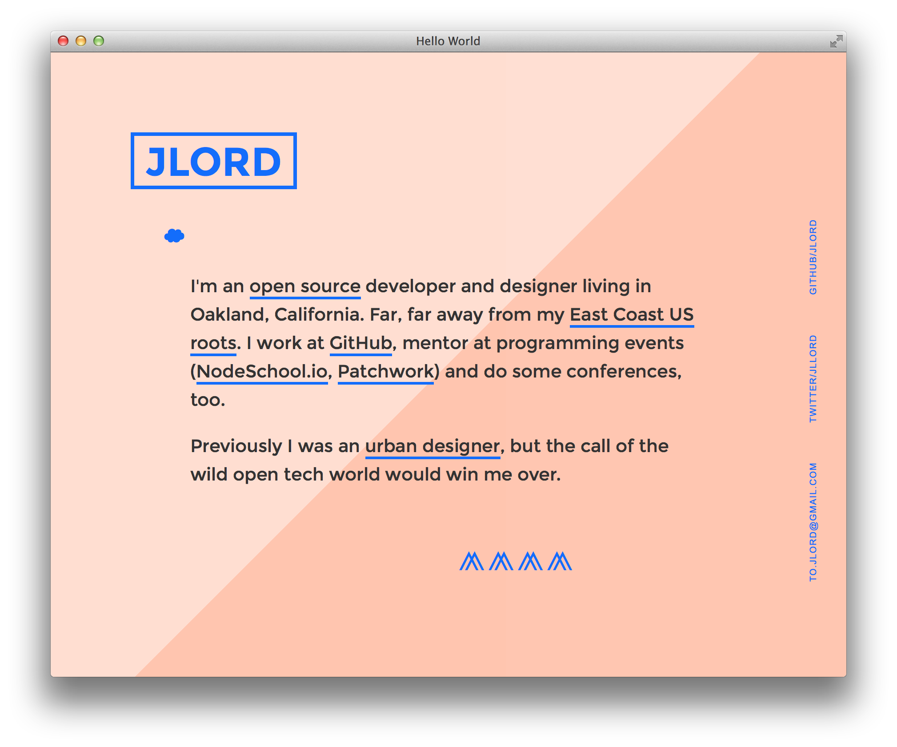
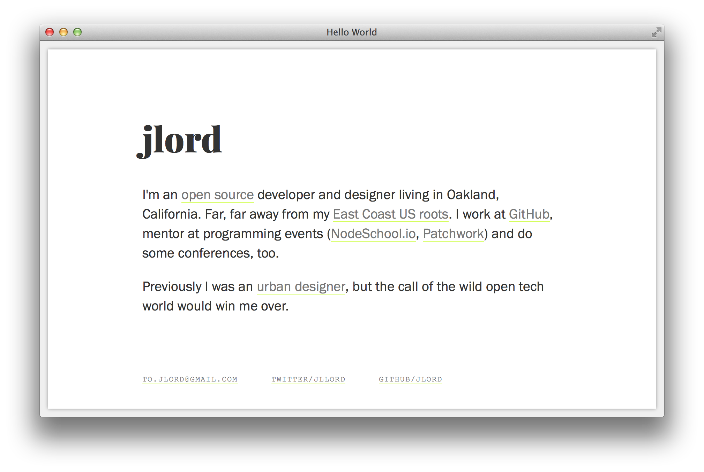

# Hello Page




A so very simple personal site.

This is a [Fork-n-Go](http://jlord.github.io/forkngo) project, so fork to get started making your own.

See the demo at [jlord.github.io/hello](http://jlord.github.io/hello).

## Create your own


| You'll Need:                                   | ☟                                                 |
| -----------------------------------------------| ------------------------------------------------- |
| [GitHub](http://www.github.com/join) account | Basic [HTML](http://learn.shayhowe.com/html-css/) |


### First, fork this repository.

Click the fork button in the upper right. Now you have a copy of this repository on your GitHub account!

### Rename your fork

Once you've forked it, click on Settings and rename your fork, because probably `hello` is not what you want in your URL. Name your new repository: `username.github.io` (but make `username` your username, for instance, I'd use `jlord.github.io`). GitHub will host all website files on the `master` branch of a repo with that account name convention. Woo! More info on that at [pages.github.com](http://www.pages.github.com).

You can also give it any 'ol name and GitHub will host it using this patter: `username.github.io/reponame`. Or you can keep it named `hello` and find it at: `username.github.io/hello`.

### Make yours live

1. From your fork's page on GitHub, click the index.html link, then on the next page click Edit.
2. Make changes to the HTML so that the site reflects your name and bio.
8. At the bottom of the site, click the Commit button to save your changes.

Now your site is live! Go check it out!


### Style

There are basic styles included in `style.css` but go wild and make it your own, try other things!

### Bonus Style



There is another style option included within this repository. If you change the CSS file specified on **line 7** in `index.html` to:

```HTML
<link rel="stylesheet" type="text/css" href="css/style.css"
```

Then you'll get the other option! Commit your changes to make it live. Change the file called for back to `css/style2.css` to go back to the other.
